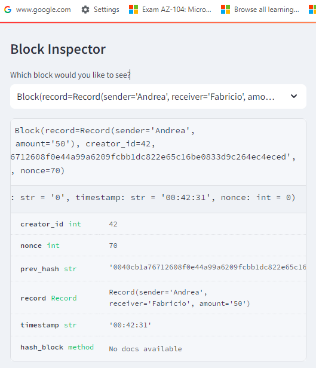

- **Module 18 Challenge** 

**Overview**

The goal of this challenge is to create an easy-to-use blockchain ledger system with the help of streamlit service using the python file pychain.py. In this file, you can enter the details of the sender, the recipient, and the transfer amount and each transaction will be entered into the blockchain based ledger system. 

**Testing the pychain ledger** 

***# Blockchain that consists of multiple blocks.***

***# The Validity of the Block Chain***

***The Block Inspector to Visualize the Block***

